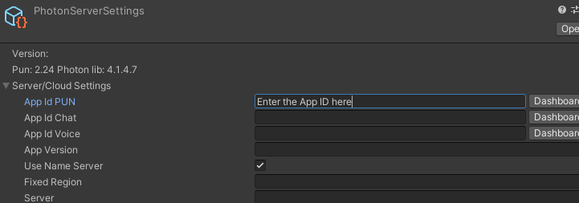
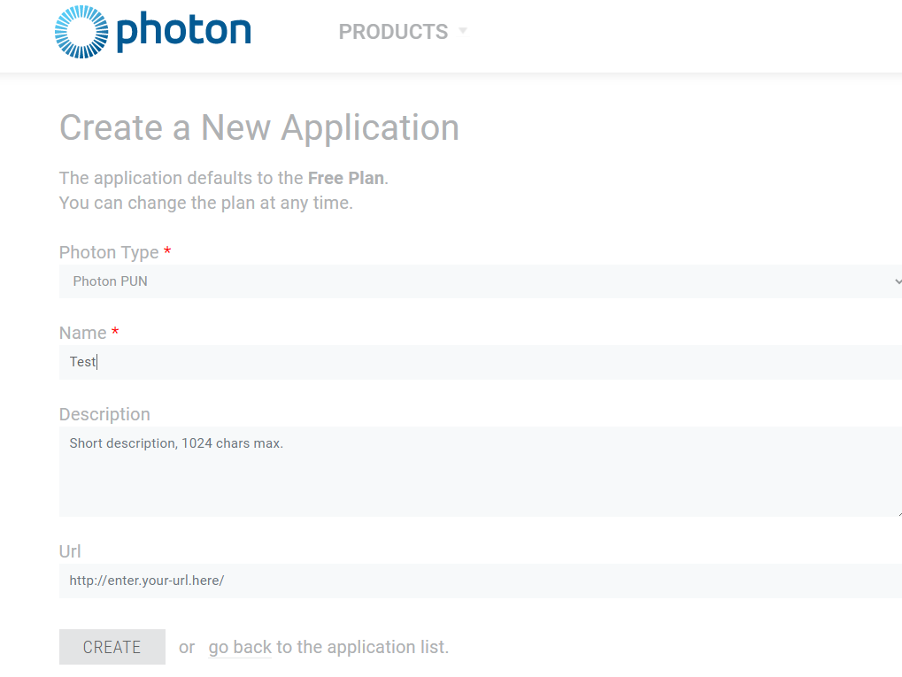
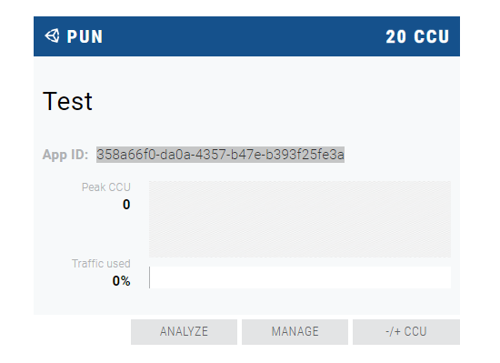
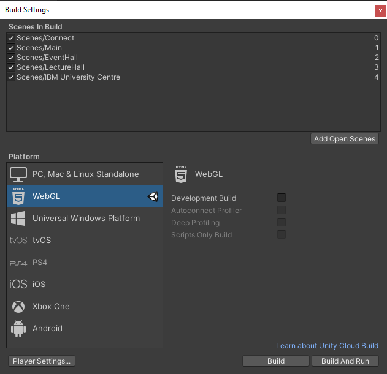

# Uniworld Developer Guide
##### A guide for developers on how to setup the development environment, cloud service dependencies, and deployment.

Uniworld is a real-time 3D environment for university events. This was developed as part of the MEng Computer Science degree final year project at UCL and collaborated with IBM as part of the Industry Exchange Network (IXN).

## Features

- **3D Environment** – The 3D environment contains a lobby scene, event hall, lecture hall, and IBM university centre.
    - The event hall contains dynamically created rooms with meeting tables arranged in a grid layout
    - The lecture hall contains dynamically created rooms with an embedded lecture slide
    - Rooms are dynamically created via the Editor and loaded from the API
    - The IBM university centre contains objects linked to online learning resources and past project showcases as part of the IBM university programs.


- **Editor** – The web-based tool for creating and managing virtual event rooms and lecture rooms.

- **API** – The backend which provides RESTful endpoints for reading and manipulating event room and lecture room data from the database. Also, it provides endpoints for uploading files to Azure blob storage.

## Technology Stack

The uniworld project uses a wide range of technologies:
- [Unity](https://unity.com/) - 3D game engine for the main Uniworld environment
- [Photon Engine](https://www.photonengine.com/) - Networking engine and multiplayer platform integrated with Unity
- [ReactJS](https://reactjs.org/) - Front-end Javascript library for Uniworld Editor
- [Material UI](https://material-ui.com/) - Popular React UI framework
- [Azure Functions](https://azure.microsoft.com/en-us/services/functions/) - Serverless REST API for Uniworld
- [Azure Blob Storage](https://azure.microsoft.com/en-us/services/storage/blobs/) - Blob storage for uploading media files

## Uniworld 3D Environment
### Setup Guide
1. Install [Unity Hub](https://unity3d.com/get-unity/download) and [Unity 2019.4.10](https://unity3d.com/get-unity/download/archive)

2. Download the repository available at: [https://github.com/bymi15/uniworldsrc](https://github.com/bymi15/uniworldsrc) and move the `UniworldWithoutVoice` directory to the Unity project directory. Instructions on how to import projects into Unity is available at: [https://docs.unity3d.com/2018.3/Documentation/Manual/GettingStartedOpeningProjects.html](https://docs.unity3d.com/2018.3/Documentation/Manual/GettingStartedOpeningProjects.html)

3. Launch Unity and wait for it to finish importing the assets (this may take a while)

4. Go to Window > Photon Unity Network > Highlight Server Settings
    (or open `Assets/Photon/PhotonUnityNetworking/Resources/PhotonServerSettings.asset` in the Unity Editor).
    
    Next, fill in the App Id PUN value: 

    

    The App Id can be obtained by registering an account at [Photon Engine](https://www.photonengine.com/) and creating a **Photon PUN** app.
<p float="left">    
    
    
</p>

5. If you wish to use voice functionality, copy the `UniworldWithVoice` folder instead of the `UniworldWithoutVoice` folder.     **Note:** This will require purchasing the asset: [Voice Pro - WebGL, Mobile, Desktop](https://assetstore.unity.com/packages/tools/input-management/voice-pro-webgl-mobile-desktop-169274) available in the Unity asset store.
    - To use this implementation:
        1. Purchase the [Voice Pro - WebGL, Mobile, Desktop](https://assetstore.unity.com/packages/tools/input-management/voice-pro-webgl-mobile-desktop-169274) asset
        2. Move the contents of the asset into: `Assets/Scripts/Networking/Voice`
        3. Open the `Connect` scene (found in `Assets/Scenes/Connect.unity`)
        4. Select the `VoiceManager` game object and remove any scripts causing errors
        5. Attach `Listener` and `Speaker` scripts to the game object

### Build and Deployment Guide
1. Go to File > Build Settings
2. Make sure WebGL is selected as the platform and click build


3. Once the build is complete, the following should be generated:
    - `Build`
        - `Build.data.unityweb`
        - `Build.json`
        - `Build.wasm.code.unityweb`
        - `Build.wasm.framework.unityweb`
        - `UnityLoader.js`
    - `TemplateData`
    - `index.html`
4. Simply upload the contents to a static host or cloud storage platform such as `Github Pages` and `Amazon S3`.
5. Feel free to modify `index.html` and `TemplateData` to customise the web page or replace them with the template provided in: [https://github.com/bymi15/uniworldsrc/tree/main/CustomBuild](https://github.com/bymi15/uniworldsrc/tree/main/CustomBuild)
 
## Uniworld Editor (Front-end React App)
### Setup Guide
0. Make sure you have [NodeJS](https://nodejs.org/en/) installed
1. Download the Github repository: [https://github.com/bymi15/uniworldeditor](https://github.com/bymi15/uniworldeditor)
2. Update the `src/config.js` file as follows:
    - Change the `baseURL` value to the URL of the deployed Uniworld API Back-end
    - Change the `platformURL` value to the URL of the deployed application
      (e.g. `"https://<USERNAME>.github.io/<REPOSITORY_NAME>"`)
3. Open the terminal and run `npm install` to install the dependencies
4. Run `npm run test` to run the unit / integration tests
5. Run `npm start` to run the application locally (for development)
### Deployment Guide
- Run `npm run build` to build the application and generate static html/css/js files that can be manually deployed to any static host or cloud storage platform such as `Github Pages` and `Amazon S3`.
- Run `npm run deploy` to automatically deploy the application to Github pages.
    **Note**: This will require you to create a new repository to copy the files in and update the `homepage` field in `package.json` to: `"https://<USERNAME>.github.io/<REPOSITORY_NAME>"`

## Uniworld API (Back-end)
### Pre-requisites
- Register an Azure account at: [https://azure.microsoft.com/](https://azure.microsoft.com/)
- Go to the Azure portal: [https://portal.azure.com/](https://portal.azure.com/) and login to your account
    - Create a **Function App** resource and take note of the URL
    - Create a **Azure Cosmos DB** resource and take note of the *db port, username and password* displayed under:
      *Settings > Connection String*
    - Create a **Storage account** and make sure to set *account kind* as *blob storage*.
      Also, take note of the *connection string* displayed under:
      *Settings > Access Keys*
- Install [VS Code](https://code.visualstudio.com/)
- Install the [Azure Functions](https://marketplace.visualstudio.com/items?itemName=ms-azuretools.vscode-azurefunctions) VS Code extension and login with your Azure account

### Setup Guide
0. Make sure you have [NodeJS](https://nodejs.org/en/) installed
1. Download the Github repository: [https://github.com/bymi15/uniworldapi](https://github.com/bymi15/uniworldapi)
2. Open a terminal and run `npm install` to install the dependencies
3. Create a file called: `local.settings.json` in the root directory with the following content and make sure to fill in the correct values (these values can be obtained through the Azure Portal):
```
{
  "IsEncrypted": false,
  "Values": {
    "AzureWebJobsStorage": "",
    "FUNCTIONS_WORKER_RUNTIME": "node",
    "DB_NAME": "ENTER_DB_NAME",
    "DB_PORT": 10255,
    "DB_USER": "ENTER_DB_USER",
    "DB_PASSWORD": "ENTER_DB_PASSWORD",
    "BLOBSTORAGE_BASE_URL": "https://ENTER_BLOBSTORAGE_NAME.blob.core.windows.net",
    "BLOBSTORAGE_CONNECTION_STRING": "DefaultEndpointsProtocol=https;AccountName=ENTER_ACCOUNT_NAME;AccountKey=ENTER_BLOBSTORAGE_ACCOUNT_KEY_HERE;EndpointSuffix=core.windows.net"
  },
  "Host": {
    "CORS": "*"
  }
}
```
4. Press `F5` in VS Code or run the command: `npm start` to run the app locally

### Deployment Guide
- The `.github/workflows/main_uniworld.yml` Github Action file should already be set up
- Pushing any code to the `main` branch will automatically deploy the code to production

### Available API Endpoints
| Function | Request Type | URL |
| ------ | ------ | ------ |
| blobs-delete | DELETE | api/blobs/{container} |
| blobs-get | GET | api/blobs/{container} |
| blobs-post | POST | api/blobs/{container} |
| eventrooms-delete | DELETE | api/eventrooms/{id} |
| eventrooms-get | GET | api/eventrooms |
| eventrooms-getbyid | GET | api/eventrooms/{id} |
| eventrooms-post | POST | api/eventrooms |
| eventrooms-put | PUT | api/eventrooms/{id} |
| lecturerooms-delete | DELETE | api/lecturerooms/{id} |
| lecturerooms-get | GET | api/lecturerooms |
| lecturerooms-getbyid | GET | api/lecturerooms/{id} |
| lecturerooms-post | POST | api/lecturerooms |
| lecturerooms-put | PUT | api/lecturerooms/{id} |

## License

AGPL-3.0 License